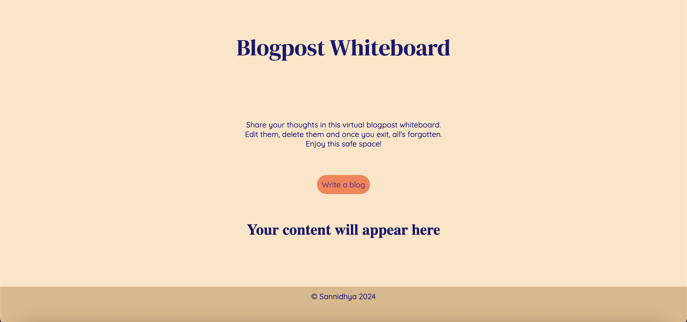

This is a simple blogpost whiteboard website. You can publish your blogposts, edit and delete them.  
To run this website, clone the repository: `git clone https://github.com/the-vedic-guy/Blogpost-Whiteboard.git`  
Once the server is quit, the memory is deleted.  
Simply run npm: `npm install` .  
Your server will run at http://localhost:3000/
